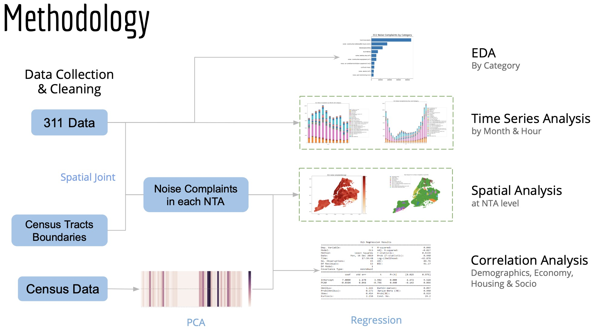
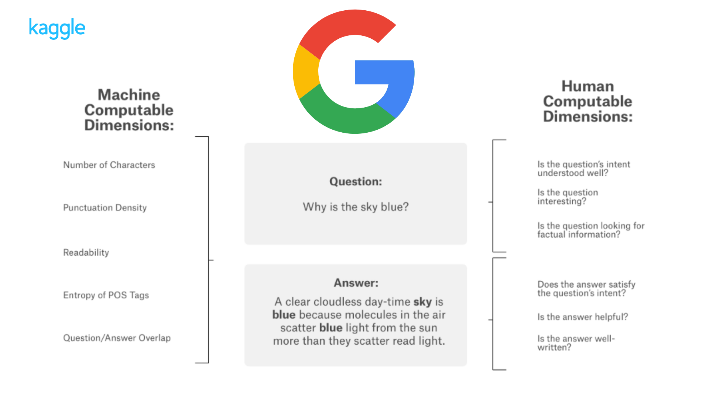

# Portfolio
---
## Data Science

[**Pipeline Leakage Diagnoses: how can we response in time and reduce the impact of lifeline pipe network accidents?**](https://github.com/carajumpshigh/Pipeline_Leakage_Diagnosis_based_on_Data_Monitoring_and_Machine_Learning)

 The purpose of this data mining project is to builds a leakage detection model based on data analysis of the multi-source data of the existing gas pipeline network monitoring system(SCADA) of Suzhou, China, and then establishes the risk early warning system of the leakage of each pipeline segment, so as to response in time and reduce the impact of lifeline pipe network accidents.

 
For the initial anomaly detection model, I plot the line charts to show the daily trend of the pipeline pressure of the SCADA measuring points, and use Dynamic time warping(DTW) algorithm to measure the similarity of them. Then I do clustering to generate typical modes of the daily trends and find the risky modes with most pipeline lackage happening. Specifically, I generate double-layer clustering to develop the efficiency of this model by reducing 98% of the total calculation, considering the huge dataset(over 16,000 records).
 

With geospatial data of the historical leakage accidents, I further improved the efficiency of the model by defining the risk clusters, with the idea that the pipelines are affected by their "neighbors", and there are more important pipelines(e.g. with more connecting pipes) that can be used to represent the mode of their "adjunctive" pipes in the risk cluster. I identify the representative pipelines with Page Rank algorithm and further reduce the runtime of our model by adding another layer of clustering.

 
Models: Anomaly detection, DTW, Spectral clustering, Page Rank
 

---
[**Analysis of NYC 311 Noise Complaints: Fun Facts about Noise in NYC**](https://github.com/carajumpshigh/Analysis_of_NYC_Noise_Complaints)

 This project analyzes NYC 311 noise complaints and sees how the complaints of differet kinds of noise distribute geographically and change by the time of day/year. After feature engineering with PCA, regression is applied to study the correlation between noise complaints and demographic, economic and socio attributes in different neighborhoods.

 
Some interesting findings: 1) Noise complaints are reported more frequently in summer; 2) While in most part of New York, the main reasons of noise complaints is loud music and parties, people in Manhattan, Brooklyn Height and Red Hook tend to report more about construction noise, and people in Upper Bronx are mostly annoyed by ice cream trucks; 3) Education and Origin factors take the lead in related factors, followed by Salary and Race. 

 
 
Models: Time series analysis, Spatial joint, PCA, Regression
 
  
---
[**Product Differentiation in the Automobiles Market: An Empirical Analysis**](https://github.com/Emmyphung/car_models/blob/master/README.md)

 This research project examined the quality vs. fuel-efficiency trade-offs between low-end and high-end car models. I first consolidated a cross-sectional dataset of 10,000+ observations (2005–2014) and 22 variables from 3 sources. I then developed a Double-Log Regression model to estimate the average miles-per-gallon of an automobile model based on its design features and real market price. 
For feature engineering, I conducted Pearson’s correlation test to detect and reduce multi-collinearity problem; used year-fixed effects to avoid serial correlation. 
 
 
Models: Linear Regression, Lin-Log and Double-Log models. 
Results: Final R_squared: 0.7984 | Final MSE: 0.0024.
 

 

---
## Natural Language Processing

[**Sentiment Analysis on Movie Reviews: Logistic Regression vs. Naive Bayes Bernoulli**](https://github.com/Emmyphung/Sentiment-Analysis)

 This notebook will compare the performance of two NLP techniques, Count Vectorizor and TF-IDF Vectorizer, and two classification models, Logistic Regression and Bernoulli Naive Bayes in sentiment analysis. I'll give detailed explanation on which model performs better and why.

 

 
 

---
[**Kaggle Competition: Google QUEST Q&A Labelling**](https://github.com/JasonZhangzy1757/Kaggle_Google_QUEST_QA_Labeling)

 Google Q&A Labelling is a classification problem related to NLP. Given pairs of questions and answers, we are asked to classify the question types, answer types, level of helpfulness of the answers, etc. For this project, I conducted comprehensive EDA to understand the datasets and important variables, split the dataset and trained the model individually to solve class imbalance issue, and used BERT pretuned models to process natural language and Tensorflow to solve the classification problem.

 
Models: BERT pretuned model, deep learning model with Tensorflow

 

---
## Math Modelling

[**Projected growth of Neurendocrine cells using Matlab**](https://github.com/Emmyphung/Neurendocrine-cells)

The project aims at tracking the three phase transformation of neuroendocrine cells specific to the human colon. A stem cell transforms into a progenitor cell and finally a mature cell through symmetric and asymmetric cell division. Symmetric cell division, also known as self-renewal, occurs when a stem cell divides symmetrically into two identical stem cells. Asymmetric cell division characterizes the maturation process when a stem cell divides into a stem cell and a progenitor cell, or a progenitor cell divides into a progenitor cell and a mature cell. In each phase, cells also experience apoptosis. meaning cell death. With an aim to capture this phenomenon, I want to build a model that track the number of cells in each phase, stem cells, progenitor cells and mature cells.

---
## Community Projects

[**Data Science in Brief (@DSinbrief Facebook Page & Group)**](https://www.facebook.com/DSinbrief/)

 Data Science in Brief (@DSinbrief) is an organization, a learning community that aims at 1) sharing knowledge to inspire young learners and to keep experienced scientists updated with state-of-the-art practices & applications; and 2) connecting young Data Science enthusiasts – learners – practitioners with leading experts in the field for learning and career opportunities
 
• Reached 11,000 readers within the 1st month (organically) 
• Organized Data Science in Brief: Hands-on Experience & Career Navigation (VN, 2019), a full-day conference that welcomed 146 attendees and 10 guest speakers from giant tech companies (Google, Hitachi, FPT Worldwide) and top universities (Johns Hopkins, NYU, etc.)

 
---

© 2020 Kunru Lu. Powered by Jekyll and the Minimal Theme.

