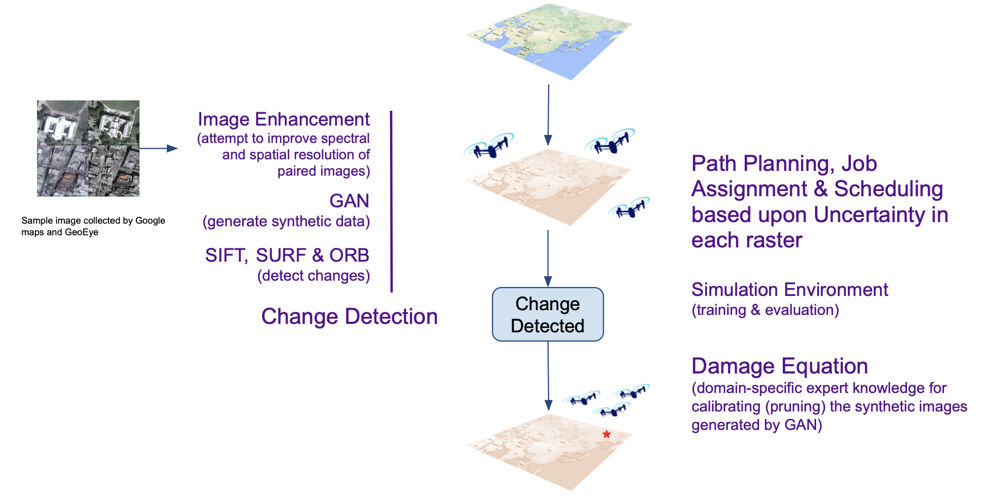

# Portfolio
---
## Data Science

[**Applying Multi-Agent RL to SLAM with Graph Pose for Sampled-Data MPC and CPN of Autonomous Drone Swarms**](https://yuejinyz.github.io/2020CapstoneProject.github.io/index.html)

 This project aims to use a swarm of drones that navigate autonomously in a GPS deprived post-disaster scenario to map structural damage.

 
First, we input pre-disaster map to the drone swarm, then we do path planning, job assignment and scheduling of the drones based on uncertainty in each raster using Deep Q-Learning algorithm, and this step also involves building a simulation environment for training and evaluation. Then, the drones will detect changes of the environment from the input map. For change detection, firstly, we do image enhancement to improve spectral and spatial resolution of paired images. Then, we use GAN to generate synthetic data, SIFT/SURF and ORB to detect changes and damage equation as export knowledge for calibrating the synthetic images generated by GAN. After change is detected, the drones will communicate with each other and then fly to the change spot and generate detailed map.
 

 
 
Models: Change Detection, Path Planning, GAN, SIFT/SURF/ORB, Deep Q-Learning
 
  
---
[**Pipeline Leakage Diagnoses: how can we response in time and reduce the impact of lifeline pipe network accidents?**](https://github.com/carajumpshigh/Pipeline_Leakage_Diagnosis_based_on_Data_Monitoring_and_Machine_Learning)

 The purpose of this data mining project is to builds a leakage detection model based on data analysis of the multi-source data of the existing gas pipeline network monitoring system(SCADA) of Suzhou, China, and then establishes the risk early warning system of the leakage of each pipeline segment, so as to response in time and reduce the impact of lifeline pipe network accidents.

 
For the initial anomaly detection model, I plot the line charts to show the daily trend of the pipeline pressure of the SCADA measuring points, and use Dynamic time warping(DTW) algorithm to measure the similarity of them. Then I do clustering to generate typical modes of the daily trends and find the risky modes with most pipeline lackage happening. Specifically, I generate double-layer clustering to develop the efficiency of this model by reducing 98% of the total calculation, considering the huge dataset(over 16,000 records).
 

With geospatial data of the historical leakage accidents, I further improved the efficiency of the model by defining the risk clusters, with the idea that the pipelines are affected by their "neighbors", and there are more important pipelines(e.g. with more connecting pipes) that can be used to represent the mode of their "adjunctive" pipes in the risk cluster. I identify the representative pipelines with Page Rank algorithm and further reduce the runtime of our model by adding another layer of clustering.

 
Models: Anomaly detection, DTW, Spectral clustering, Page Rank
 

---
## Urban Analysis

[**Analysis of NYC 311 Noise Complaints: Fun Facts about Noise in NYC**](https://github.com/carajumpshigh/Analysis_of_NYC_Noise_Complaints)

 This project analyzes NYC 311 noise complaints and sees how the complaints of differet kinds of noise distribute geographically and change by the time of day/year. After feature engineering with PCA, regression is applied to study the correlation between noise complaints and demographic, economic and socio attributes in different neighborhoods.

 
Some interesting findings: 1) Noise complaints are reported more frequently in summer; 2) While in most part of New York, the main reasons of noise complaints is loud music and parties, people in Manhattan, Brooklyn Height and Red Hook tend to report more about construction noise, and people in Upper Bronx are mostly annoyed by ice cream trucks; 3) Education and Origin factors take the lead in related factors, followed by Salary and Race. 
 

 
 
Models: Time series analysis, Spatial joint, PCA, Regression
 
  
---
[**Analysis of Airbnb house pricing in NYC & LA:**](https://github.com/carajumpshigh/Analysis_of_Airbnb_house_pricing_in_NYC_and_LA)

 This research project
 
 
Models: Linear Regression, Lin-Log and Double-Log models. 
Results: Final R_squared: 0.7984 | Final MSE: 0.0024.
 

 

---
## Natural Language Processing

[**Kaggle Competition: Google QUEST Q&A Labelling**](https://github.com/JasonZhangzy1757/Kaggle_Google_QUEST_QA_Labeling)

 Google Q&A Labelling is a classification problem related to NLP. Given pairs of questions and answers, we are asked to classify the question types, answer types, level of helpfulness of the answers, etc. For this project, I conducted comprehensive EDA to understand the datasets and important variables, split the dataset and trained the model individually to solve class imbalance issue, and used BERT pretuned models to process natural language and Tensorflow to solve the classification problem.

 
Models: BERT pretuned model, deep learning model with Tensorflow

---

© 2020 Kunru Lu. Powered by Jekyll and the Minimal Theme.

